# Production Readiness Design Document

## Overview

This design document outlines the comprehensive production readiness validation framework for the Secure Gate Access Control System. The system requires thorough testing and validation across all components to ensure zero-error launch capability for both web and mobile applications. The design encompasses user functionality validation, UI/UX compliance, security testing, performance optimization, and complete production environment readiness.

## Architecture

### Production Readiness Testing Framework

The production readiness framework consists of multiple validation layers:

```mermaid
graph TB
    A[Production Readiness Framework] --> B[User Functionality Layer]
    A --> C[UI/UX Compliance Layer]
    A --> D[Integration Testing Layer]
    A --> E[Security Validation Layer]
    A --> F[Performance Testing Layer]
    A --> G[Production Environment Layer]
    
    B --> B1[Role-Based Testing]
    B --> B2[Workflow Validation]
    B --> B3[Cross-Role Integration]
    
    C --> C1[Cross-Browser Testing]
    C --> C2[Accessibility Compliance]
    C --> C3[Mobile Optimization]
    
    D --> D1[API Integration]
    D --> D2[Real-Time Features]
    D --> D3[Data Synchronization]
    
    E --> E1[Security Scanning]
    E --> E2[Penetration Testing]
    E --> E3[Compliance Validation]
    
    F --> F1[Load Testing]
    F --> F2[Stress Testing]
    F --> F3[Performance Monitoring]
    
    G --> G1[Deployment Validation]
    G --> G2[Monitoring Setup]
    G --> G3[Backup Systems]
```



### Multi-Dimensional Testing Strategy

The testing strategy covers multiple dimensions simultaneously:

1. **Functional Dimension**: All user roles and workflows
2. **Technical Dimension**: All system components and integrations
3. **Platform Dimension**: All supported browsers and devices
4. **Performance Dimension**: Load, stress, and scalability testing
5. **Security Dimension**: Vulnerability assessment and compliance
6. **Operational Dimension**: Deployment, monitoring, and maintenance

## Components and Interfaces

### User Functionality Validation System

```javascript
// Comprehensive user role testing framework
class UserFunctionalityValidator {
  constructor() {
    this.roleValidators = new Map();
    this.workflowValidators = new Map();
    this.integrationValidators = new Map();
    this.setupValidators();
  }

  setupValidators() {
    // Super Admin validation
    this.roleValidators.set('super_admin', new SuperAdminValidator({
      crossEstateAccess: true,
      platformManagement: true,
      systemOverview: true,
      userImpersonation: true,
      auditTrailAccess: true
    }));

    // Estate Admin validation
    this.roleValidators.set('estate_admin', new EstateAdminValidator({
      userManagement: true,
      visitorReporting: true,
      systemConfiguration: true,
      incidentManagement: true,
      bulkOperations: true
    }));

    // Security Guard validation
    this.roleValidators.set('guard', new GuardValidator({
      qrScanning: true,
      visitorCheckIn: true,
      incidentReporting: true,
      realTimeUpdates: true,
      mobileOptimization: true
    }));

    // Resident validation
    this.roleValidators.set('resident', new ResidentValidator({
      visitorInvitation: true,
      approvalWorkflows: true,
      visitorTracking: true,
      notificationPreferences: true,
      mobileAccess: true
    }));

    // Visitor validation
    this.roleValidators.set('visitor', new VisitorValidator({
      selfService: true,
      qrCodeAccess: true,
      visitConfirmation: true,
      statusUpdates: true,
      publicAccess: true
    }));
  }

  async validateAllRoles() {
    const results = new Map();
    
    for (const [role, validator] of this.roleValidators) {
      try {
        const result = await validator.validateComplete();
        results.set(role, result);
      } catch (error) {
        results.set(role, { success: false, error: error.message });
      }
    }
    
    return results;
  }

  async validateWorkflowIntegration() {
    const workflows = [
      'visitor_invitation_to_checkout',
      'bulk_invite_management',
      'incident_reporting_workflow',
      'user_approval_process',
      'cross_role_collaboration'
    ];

    const results = new Map();
    
    for (const workflow of workflows) {
      const validator = this.workflowValidators.get(workflow);
      if (validator) {
        results.set(workflow, await validator.validate());
      }
    }
    
    return results;
  }
}
```

### UI/UX Compliance Testing System

```javascript
// Comprehensive UI/UX compliance validation
class UIUXComplianceValidator {
  constructor() {
    this.browserMatrix = [
      { name: 'Chrome', versions: ['120+', '119', '118'] },
      { name: 'Firefox', versions: ['121+', '120', '119'] },
      { name: 'Safari', versions: ['17+', '16', '15'] },
      { name: 'Edge', versions: ['120+', '119', '118'] }
    ];
    
    this.deviceMatrix = [
      { type: 'desktop', resolutions: ['1920x1080', '1366x768', '2560x1440'] },
      { type: 'tablet', resolutions: ['768x1024', '1024x768', '834x1194'] },
      { type: 'mobile', resolutions: ['375x667', '414x896', '360x640'] }
    ];
    
    this.accessibilityChecks = new AccessibilityValidator();
  }

  async validateCrossBrowserCompatibility() {
    const results = [];
    
    for (const browser of this.browserMatrix) {
      for (const version of browser.versions) {
        const testResult = await this.runBrowserTest(browser.name, version);
        results.push({
          browser: browser.name,
          version,
          passed: testResult.passed,
          issues: testResult.issues
        });
      }
    }
    
    return results;
  }

  async validateResponsiveDesign() {
    const results = [];
    
    for (const device of this.deviceMatrix) {
      for (const resolution of device.resolutions) {
        const testResult = await this.runResponsiveTest(device.type, resolution);
        results.push({
          device: device.type,
          resolution,
          passed: testResult.passed,
          layoutIssues: testResult.layoutIssues,
          touchTargets: testResult.touchTargets
        });
      }
    }
    
    return results;
  }

  async validateAccessibilityCompliance() {
    return await this.accessibilityChecks.runFullAudit({
      wcagLevel: 'AA',
      includeAAA: true,
      testScreenReaders: true,
      testKeyboardNavigation: true,
      testColorContrast: true,
      testFocusManagement: true
    });
  }
}
```

### Security Validation Framework

```javascript
// Comprehensive security testing system
class SecurityValidationFramework {
  constructor() {
    this.vulnerabilityScanner = new VulnerabilityScanner();
    this.penetrationTester = new PenetrationTester();
    this.complianceValidator = new ComplianceValidator();
    this.securityHeaders = new SecurityHeaderValidator();
  }

  async runComprehensiveSecurityAudit() {
    const results = {
      vulnerabilityScanning: await this.runVulnerabilityScanning(),
      penetrationTesting: await this.runPenetrationTesting(),
      complianceValidation: await this.runComplianceValidation(),
      securityHeaders: await this.validateSecurityHeaders(),
      authenticationTesting: await this.testAuthentication(),
      authorizationTesting: await this.testAuthorization(),
      dataProtection: await this.testDataProtection(),
      sessionManagement: await this.testSessionManagement()
    };

    return results;
  }

  async runVulnerabilityScanning() {
    return await this.vulnerabilityScanner.scan({
      targets: [
        'https://api.secure-gate.app',
        'https://secure-gate.app',
        'database-endpoints',
        'file-upload-endpoints'
      ],
      scanTypes: [
        'sql-injection',
        'xss',
        'csrf',
        'directory-traversal',
        'file-inclusion',
        'command-injection',
        'xxe',
        'ssrf'
      ],
      severity: ['critical', 'high', 'medium', 'low']
    });
  }

  async runPenetrationTesting() {
    return await this.penetrationTester.execute({
      authenticationBypass: true,
      privilegeEscalation: true,
      dataExfiltration: true,
      businessLogicFlaws: true,
      apiSecurity: true,
      mobileAppSecurity: true,
      socialEngineering: false // Automated testing only
    });
  }

  async runComplianceValidation() {
    return await this.complianceValidator.validate({
      gdpr: {
        dataMinimization: true,
        consentManagement: true,
        rightToErasure: true,
        dataPortability: true,
        privacyByDesign: true
      },
      kdpa: {
        dataProtection: true,
        consentRequirements: true,
        dataTransfer: true,
        breachNotification: true
      },
      iso27001: {
        informationSecurity: true,
        riskManagement: true,
        accessControl: true,
        cryptography: true
      }
    });
  }
}
```

### Performance Testing Framework

```javascript
// Comprehensive performance validation system
class PerformanceTestingFramework {
  constructor() {
    this.loadTester = new LoadTester();
    this.stressTester = new StressTester();
    this.performanceMonitor = new PerformanceMonitor();
    this.mobilePerformanceTester = new MobilePerformanceTester();
  }

  async runComprehensivePerformanceTests() {
    const results = {
      loadTesting: await this.runLoadTesting(),
      stressTesting: await this.runStressTesting(),
      enduranceTesting: await this.runEnduranceTesting(),
      spikeLoading: await this.runSpikeLoading(),
      mobilePerformance: await this.runMobilePerformanceTests(),
      databasePerformance: await this.runDatabasePerformanceTests(),
      cachePerformance: await this.runCachePerformanceTests(),
      networkPerformance: await this.runNetworkPerformanceTests()
    };

    return results;
  }

  async runLoadTesting() {
    const scenarios = [
      {
        name: 'normal_load',
        users: 100,
        duration: '10m',
        rampUp: '2m'
      },
      {
        name: 'peak_load',
        users: 500,
        duration: '15m',
        rampUp: '5m'
      },
      {
        name: 'high_load',
        users: 1000,
        duration: '20m',
        rampUp: '10m'
      }
    ];

    const results = [];
    
    for (const scenario of scenarios) {
      const result = await this.loadTester.run({
        scenario: scenario.name,
        virtualUsers: scenario.users,
        duration: scenario.duration,
        rampUpTime: scenario.rampUp,
        endpoints: [
          '/api/auth/login',
          '/api/visitors',
          '/api/visitors/{id}/check-in',
          '/api/dashboard/metrics',
          '/api/admin/users'
        ],
        acceptanceCriteria: {
          responseTime: {
            p95: 2000, // 2 seconds
            p99: 5000  // 5 seconds
          },
          errorRate: 0.1, // 0.1%
          throughput: 100 // requests per second
        }
      });
      
      results.push(result);
    }
    
    return results;
  }

  async runMobilePerformanceTests() {
    const devices = [
      { name: 'iPhone 12', network: '4G' },
      { name: 'Samsung Galaxy S21', network: '4G' },
      { name: 'iPhone SE', network: '3G' },
      { name: 'Budget Android', network: '3G' }
    ];

    const results = [];
    
    for (const device of devices) {
      const result = await this.mobilePerformanceTester.test({
        device: device.name,
        network: device.network,
        metrics: [
          'first-contentful-paint',
          'largest-contentful-paint',
          'first-input-delay',
          'cumulative-layout-shift',
          'time-to-interactive'
        ],
        acceptanceCriteria: {
          fcp: 1500, // 1.5 seconds
          lcp: 2500, // 2.5 seconds
          fid: 100,  // 100ms
          cls: 0.1,  // 0.1
          tti: 3500  // 3.5 seconds
        }
      });
      
      results.push(result);
    }
    
    return results;
  }
}
```

### Production Environment Validation

```javascript
// Production deployment readiness validator
class ProductionEnvironmentValidator {
  constructor() {
    this.deploymentValidator = new DeploymentValidator();
    this.monitoringValidator = new MonitoringValidator();
    this.backupValidator = new BackupValidator();
    this.scalingValidator = new ScalingValidator();
  }

  async validateProductionReadiness() {
    const results = {
      deployment: await this.validateDeployment(),
      monitoring: await this.validateMonitoring(),
      logging: await this.validateLogging(),
      backup: await this.validateBackup(),
      scaling: await this.validateScaling(),
      healthChecks: await this.validateHealthChecks(),
      configuration: await this.validateConfiguration(),
      security: await this.validateProductionSecurity()
    };

    return results;
  }

  async validateDeployment() {
    return await this.deploymentValidator.validate({
      zeroDowntime: true,
      rollbackCapability: true,
      environmentConsistency: true,
      configurationManagement: true,
      secretsManagement: true,
      databaseMigrations: true,
      assetOptimization: true,
      cacheWarming: true
    });
  }

  async validateMonitoring() {
    return await this.monitoringValidator.validate({
      applicationMetrics: {
        responseTime: true,
        errorRate: true,
        throughput: true,
        availability: true
      },
      infrastructureMetrics: {
        cpu: true,
        memory: true,
        disk: true,
        network: true
      },
      businessMetrics: {
        userRegistrations: true,
        visitorCheckIns: true,
        systemUsage: true,
        errorPatterns: true
      },
      alerting: {
        criticalAlerts: true,
        warningAlerts: true,
        escalationPolicies: true,
        notificationChannels: true
      }
    });
  }

  async validateBackup() {
    return await this.backupValidator.validate({
      databaseBackup: {
        frequency: 'daily',
        retention: '35 days',
        encryption: true,
        compression: true,
        verification: true
      },
      fileBackup: {
        frequency: 'daily',
        retention: '30 days',
        crossRegion: true,
        versioning: true
      },
      configurationBackup: {
        frequency: 'on-change',
        retention: '90 days',
        versionControl: true
      },
      recoveryTesting: {
        frequency: 'monthly',
        scenarios: ['full-restore', 'partial-restore', 'point-in-time'],
        documentation: true
      }
    });
  }
}
```

## Data Models

### Test Execution Data Model

```javascript
// Comprehensive test execution tracking
class TestExecutionModel {
  constructor() {
    this.testSuites = new Map();
    this.testResults = new Map();
    this.testMetrics = new Map();
    this.setupTestSuites();
  }

  setupTestSuites() {
    this.testSuites.set('user_functionality', {
      name: 'User Functionality Validation',
      categories: [
        'super_admin_workflows',
        'estate_admin_workflows',
        'guard_workflows',
        'resident_workflows',
        'visitor_workflows',
        'cross_role_integration'
      ],
      priority: 'critical',
      estimatedDuration: '4 hours'
    });

    this.testSuites.set('ui_ux_compliance', {
      name: 'UI/UX Compliance Testing',
      categories: [
        'cross_browser_compatibility',
        'responsive_design',
        'accessibility_compliance',
        'mobile_optimization',
        'touch_interaction',
        'keyboard_navigation'
      ],
      priority: 'critical',
      estimatedDuration: '6 hours'
    });

    this.testSuites.set('security_validation', {
      name: 'Security Validation Testing',
      categories: [
        'vulnerability_scanning',
        'penetration_testing',
        'compliance_validation',
        'authentication_testing',
        'authorization_testing',
        'data_protection'
      ],
      priority: 'critical',
      estimatedDuration: '8 hours'
    });

    this.testSuites.set('performance_testing', {
      name: 'Performance Testing Suite',
      categories: [
        'load_testing',
        'stress_testing',
        'endurance_testing',
        'spike_testing',
        'mobile_performance',
        'database_performance'
      ],
      priority: 'high',
      estimatedDuration: '12 hours'
    });

    this.testSuites.set('integration_testing', {
      name: 'Integration Testing Suite',
      categories: [
        'api_integration',
        'real_time_features',
        'data_synchronization',
        'external_services',
        'mobile_app_integration',
        'cross_platform_sync'
      ],
      priority: 'high',
      estimatedDuration: '6 hours'
    });
  }

  recordTestResult(suiteId, categoryId, testId, result) {
    const key = `${suiteId}.${categoryId}.${testId}`;
    this.testResults.set(key, {
      ...result,
      timestamp: new Date().toISOString(),
      executionTime: result.executionTime || 0
    });
  }

  generateComprehensiveReport() {
    const report = {
      summary: this.generateSummary(),
      detailedResults: this.generateDetailedResults(),
      metrics: this.generateMetrics(),
      recommendations: this.generateRecommendations(),
      readinessScore: this.calculateReadinessScore()
    };

    return report;
  }
}
```

### Production Readiness Metrics Model

```javascript
// Production readiness scoring and metrics
class ProductionReadinessMetrics {
  constructor() {
    this.weightings = {
      userFunctionality: 0.25,
      uiUxCompliance: 0.20,
      securityValidation: 0.25,
      performanceTesting: 0.15,
      integrationTesting: 0.10,
      productionEnvironment: 0.05
    };

    this.thresholds = {
      critical: 0.95, // 95% pass rate for critical tests
      high: 0.90,     // 90% pass rate for high priority tests
      medium: 0.85,   // 85% pass rate for medium priority tests
      low: 0.80       // 80% pass rate for low priority tests
    };
  }

  calculateReadinessScore(testResults) {
    let totalScore = 0;
    let totalWeight = 0;

    for (const [category, weight] of Object.entries(this.weightings)) {
      const categoryResults = testResults.filter(r => r.category === category);
      const categoryScore = this.calculateCategoryScore(categoryResults);
      
      totalScore += categoryScore * weight;
      totalWeight += weight;
    }

    return totalScore / totalWeight;
  }

  calculateCategoryScore(results) {
    if (results.length === 0) return 0;

    const passedTests = results.filter(r => r.passed).length;
    return passedTests / results.length;
  }

  generateReadinessReport(score, testResults) {
    const status = this.determineReadinessStatus(score);
    
    return {
      overallScore: score,
      status: status,
      readyForProduction: score >= this.thresholds.critical,
      categoryBreakdown: this.generateCategoryBreakdown(testResults),
      criticalIssues: this.identifyCriticalIssues(testResults),
      recommendations: this.generateRecommendations(testResults),
      estimatedTimeToReady: this.estimateTimeToReady(testResults)
    };
  }
}
```

## Correctness Properties

*A property is a characteristic or behavior that should hold true across all valid executions of a system—essentially, a formal statement about what the system should do. Properties serve as the bridge between human-readable specifications and machine-verifiable correctness guarantees.*

<function_calls>
<invoke name="prework">
<parameter name="featureName">production-readiness-comprehensive

### Property Reflection

After analyzing all acceptance criteria, I've identified several areas where properties can be consolidated to eliminate redundancy:

**Consolidation Opportunities:**
- Multiple role-specific functionality tests can be combined into a comprehensive role-based access property
- Cross-browser compatibility tests can be unified into a single cross-platform consistency property
- Various security validation tests can be consolidated into comprehensive security compliance properties
- Performance tests across different scenarios can be unified into performance baseline properties
- Data integrity tests can be combined into comprehensive data consistency properties

**Unique Value Properties:**
Each remaining property provides unique validation value without overlap, ensuring comprehensive coverage while avoiding redundant testing.

### User Functionality Properties

**Property 1: Role-based functionality completeness**
*For any* user role and estate combination, all role-specific functionality should be available and working correctly within proper authorization boundaries
**Validates: Requirements 1.1, 1.2, 1.3, 1.4, 1.5, 1.6**

**Property 2: Cross-role workflow integration**
*For any* multi-role workflow (visitor invitation to checkout, incident reporting, approval processes), all steps should complete successfully with proper data flow and state management
**Validates: Requirements 1.7, 1.8**

### UI/UX Compliance Properties

**Property 3: Cross-platform consistency**
*For any* supported browser, device, or screen size, all functionality should work identically with appropriate responsive adaptations
**Validates: Requirements 2.1, 2.2, 2.4**

**Property 4: Accessibility compliance preservation**
*For any* user interface element or interaction, WCAG 2.1 AA accessibility requirements should be met including keyboard navigation, screen reader compatibility, and high contrast support
**Validates: Requirements 2.3, 2.5, 2.6, 2.7, 2.8**

### Integration and Real-Time Properties

**Property 5: API integration reliability**
*For any* API request under normal or degraded network conditions, the system should respond within acceptable time limits with proper error handling and automatic recovery
**Validates: Requirements 3.1, 3.4, 3.5**

**Property 6: Real-time synchronization consistency**
*For any* real-time feature or data change, all connected clients should receive updates consistently with proper conflict resolution and data integrity
**Validates: Requirements 3.2, 3.3, 3.6, 3.7, 3.8**

### Security Validation Properties

**Property 7: Comprehensive security protection**
*For any* security attack vector (injection, XSS, CSRF, authentication bypass), the system should prevent unauthorized access and maintain data protection
**Validates: Requirements 4.1, 4.2, 4.5, 4.6, 4.7**

**Property 8: Data protection compliance**
*For any* data transmission or storage operation, the system should use proper encryption, secure protocols, and maintain audit trails
**Validates: Requirements 4.3, 4.4, 4.8**

### System Quality Properties

**Property 9: Codebase cleanliness and security**
*For any* code analysis or security scan, the system should contain no unused components, security vulnerabilities, or quality issues
**Validates: Requirements 5.1, 5.2, 5.3, 5.4, 5.5, 5.6, 5.7, 5.8**

**Property 10: Performance baseline compliance**
*For any* load condition or device type, the system should meet established performance baselines for response time, throughput, and resource usage
**Validates: Requirements 6.1, 6.2, 6.3, 6.4, 6.5, 6.6, 6.7, 6.8**

### Data Integrity Properties

**Property 11: Serialization round-trip consistency**
*For any* valid data object, serializing then deserializing should produce an equivalent object with proper validation and error handling
**Validates: Requirements 11.1, 11.2, 11.3, 11.4, 11.5, 11.6, 11.7, 11.8**

## Error Handling

### Comprehensive Error Management Strategy

The production readiness validation system implements multi-layered error handling to ensure robust testing and clear failure reporting:

#### Test Execution Error Handling

```javascript
class ProductionReadinessErrorHandler {
  constructor() {
    this.errorCategories = {
      CRITICAL: 'System-breaking issues that prevent production deployment',
      HIGH: 'Significant issues that impact user experience or security',
      MEDIUM: 'Issues that should be addressed but don\'t block deployment',
      LOW: 'Minor issues or improvements for future consideration'
    };
    
    this.errorRecovery = new ErrorRecoveryManager();
    this.errorReporting = new ErrorReportingSystem();
  }

  async handleTestFailure(testId, error, context) {
    const categorizedError = this.categorizeError(error, context);
    
    // Attempt automatic recovery for transient issues
    if (categorizedError.recoverable) {
      const recoveryResult = await this.errorRecovery.attempt(testId, error);
      if (recoveryResult.success) {
        return { recovered: true, result: recoveryResult };
      }
    }

    // Log detailed error information
    await this.errorReporting.logError({
      testId,
      error: categorizedError,
      context,
      timestamp: new Date().toISOString(),
      stackTrace: error.stack,
      systemState: await this.captureSystemState()
    });

    // Determine if testing should continue
    const shouldContinue = this.shouldContinueTesting(categorizedError);
    
    return {
      recovered: false,
      severity: categorizedError.severity,
      shouldContinue,
      recommendations: this.generateRecommendations(categorizedError)
    };
  }

  categorizeError(error, context) {
    // Security-related errors are always critical
    if (context.testType === 'security' && error.type === 'vulnerability') {
      return {
        severity: 'CRITICAL',
        category: 'SECURITY_VULNERABILITY',
        recoverable: false,
        blockingIssue: true
      };
    }

    // Performance degradation beyond thresholds
    if (context.testType === 'performance' && error.type === 'threshold_exceeded') {
      return {
        severity: error.exceedsBy > 0.5 ? 'HIGH' : 'MEDIUM',
        category: 'PERFORMANCE_DEGRADATION',
        recoverable: true,
        blockingIssue: error.exceedsBy > 0.5
      };
    }

    // Accessibility violations
    if (context.testType === 'accessibility' && error.type === 'wcag_violation') {
      return {
        severity: error.level === 'AA' ? 'HIGH' : 'MEDIUM',
        category: 'ACCESSIBILITY_VIOLATION',
        recoverable: false,
        blockingIssue: error.level === 'AA'
      };
    }

    // Default categorization
    return {
      severity: 'MEDIUM',
      category: 'GENERAL_FAILURE',
      recoverable: true,
      blockingIssue: false
    };
  }
}
```

#### Graceful Degradation Handling

```javascript
class GracefulDegradationManager {
  constructor() {
    this.fallbackStrategies = new Map();
    this.setupFallbackStrategies();
  }

  setupFallbackStrategies() {
    // Network connectivity issues
    this.fallbackStrategies.set('network_failure', {
      strategy: 'offline_mode',
      implementation: async (context) => {
        return await this.testOfflineCapabilities(context);
      }
    });

    // External service failures
    this.fallbackStrategies.set('external_service_failure', {
      strategy: 'mock_service',
      implementation: async (context) => {
        return await this.useMockServices(context);
      }
    });

    // Database connectivity issues
    this.fallbackStrategies.set('database_failure', {
      strategy: 'in_memory_fallback',
      implementation: async (context) => {
        return await this.useInMemoryDatabase(context);
      }
    });
  }

  async handleDegradation(failureType, context) {
    const strategy = this.fallbackStrategies.get(failureType);
    
    if (strategy) {
      try {
        const result = await strategy.implementation(context);
        return {
          success: true,
          strategy: strategy.strategy,
          result: result,
          degraded: true
        };
      } catch (fallbackError) {
        return {
          success: false,
          strategy: strategy.strategy,
          error: fallbackError,
          degraded: true
        };
      }
    }

    return {
      success: false,
      error: 'No fallback strategy available',
      degraded: false
    };
  }
}
```

## Testing Strategy

### Dual Testing Approach

The production readiness validation employs a comprehensive dual testing approach combining automated property-based testing with targeted unit testing:

#### Property-Based Testing Configuration

**Testing Framework**: Fast-check for JavaScript property-based testing
**Minimum Iterations**: 1000 iterations per property test (due to production readiness requirements)
**Test Configuration**:

```javascript
// Property test configuration for production readiness
const propertyTestConfig = {
  numRuns: 1000,
  timeout: 30000, // 30 seconds per property
  seed: Date.now(),
  path: 'production-readiness',
  verbose: true,
  examples: [],
  endOnFailure: false, // Continue testing to find all issues
  markInterruptAsFailure: true,
  interruptAfterTimeLimit: 300000, // 5 minutes max per property
  skipAllAfterTimeLimit: 600000,   // 10 minutes max total
  reporter: 'detailed'
};

// Tag format for property tests
// Feature: production-readiness-comprehensive, Property 1: Role-based functionality completeness
```

#### Unit Testing Strategy

**Unit Test Focus Areas**:
- Specific edge cases identified during property testing
- Integration points between system components
- Error conditions and boundary cases
- Mock service interactions and fallback scenarios

**Unit Test Balance**:
- Property tests handle comprehensive input coverage and general correctness
- Unit tests focus on specific scenarios, edge cases, and integration validation
- Combined approach ensures both broad coverage and detailed validation

#### Test Execution Strategy

```javascript
class ProductionReadinessTestExecutor {
  constructor() {
    this.testOrchestrator = new TestOrchestrator();
    this.parallelExecutor = new ParallelTestExecutor();
    this.reportGenerator = new ComprehensiveReportGenerator();
  }

  async executeComprehensiveValidation() {
    const testPlan = {
      phases: [
        {
          name: 'Critical Path Validation',
          parallel: false,
          tests: [
            'user_functionality_properties',
            'security_validation_properties',
            'data_integrity_properties'
          ]
        },
        {
          name: 'Platform Compatibility Validation',
          parallel: true,
          tests: [
            'cross_browser_testing',
            'mobile_compatibility_testing',
            'accessibility_compliance_testing'
          ]
        },
        {
          name: 'Performance and Load Validation',
          parallel: true,
          tests: [
            'load_testing_suite',
            'stress_testing_suite',
            'mobile_performance_testing'
          ]
        },
        {
          name: 'Integration and Real-Time Validation',
          parallel: false,
          tests: [
            'api_integration_properties',
            'real_time_synchronization_properties',
            'external_service_integration'
          ]
        }
      ]
    };

    const results = await this.testOrchestrator.execute(testPlan);
    return await this.reportGenerator.generateFinalReport(results);
  }

  async generateProductionReadinessCertification(results) {
    const certification = {
      overallScore: results.readinessScore,
      certificationLevel: this.determineCertificationLevel(results.readinessScore),
      validatedComponents: results.componentValidation,
      securityClearance: results.securityValidation.passed,
      performanceBenchmarks: results.performanceValidation.benchmarks,
      complianceStatus: results.complianceValidation,
      recommendedDeploymentDate: this.calculateDeploymentReadiness(results),
      criticalIssuesResolved: results.criticalIssues.length === 0,
      signOff: {
        technical: results.readinessScore >= 0.95,
        security: results.securityValidation.score >= 0.98,
        performance: results.performanceValidation.score >= 0.90,
        compliance: results.complianceValidation.score >= 0.95
      }
    };

    return certification;
  }
}
```

### Continuous Validation Pipeline

```javascript
class ContinuousValidationPipeline {
  constructor() {
    this.validationScheduler = new ValidationScheduler();
    this.regressionDetector = new RegressionDetector();
    this.alertingSystem = new AlertingSystem();
  }

  setupContinuousValidation() {
    // Daily smoke tests
    this.validationScheduler.schedule('daily', async () => {
      return await this.runSmokeTests();
    });

    // Weekly comprehensive validation
    this.validationScheduler.schedule('weekly', async () => {
      return await this.runComprehensiveValidation();
    });

    // Pre-deployment validation
    this.validationScheduler.onEvent('pre-deployment', async () => {
      return await this.runPreDeploymentValidation();
    });

    // Post-deployment validation
    this.validationScheduler.onEvent('post-deployment', async () => {
      return await this.runPostDeploymentValidation();
    });
  }

  async runSmokeTests() {
    const criticalTests = [
      'authentication_flow',
      'visitor_creation_flow',
      'qr_scanning_flow',
      'real_time_updates',
      'mobile_app_basic_functions'
    ];

    const results = await this.parallelExecutor.run(criticalTests);
    
    if (results.failureRate > 0.05) { // 5% failure threshold
      await this.alertingSystem.sendCriticalAlert({
        type: 'smoke_test_failure',
        failureRate: results.failureRate,
        failedTests: results.failures
      });
    }

    return results;
  }
}
```

This comprehensive production readiness design ensures thorough validation of all system components, user workflows, security measures, and performance characteristics necessary for a successful zero-error production launch of the Secure Gate Access Control System.