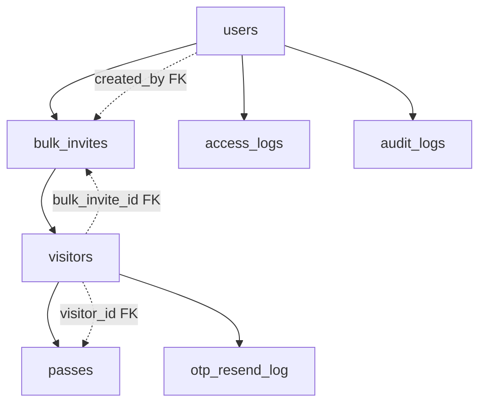

# DATABASE SECURITY ANALYSIS REPORT
**Secure Gate React-Express Application**
**Date:** January 17, 2025
**Analysis Type:** PostgreSQL Database Security Assessment

## EXECUTIVE SUMMARY

This comprehensive security analysis of the PostgreSQL database infrastructure has identified **CRITICAL** security vulnerabilities that pose immediate threats to production deployment. The analysis examined database configuration, authentication mechanisms, encryption settings, access controls, and integration patterns.

**IMMEDIATE ACTION REQUIRED:** The system is currently using default PostgreSQL credentials in production configuration, creating an **EXTREME** security risk.

---

## CRITICAL FINDINGS

### 🚨 **SEVERITY: CRITICAL** - Default Database Credentials
- **Issue:** Production `.env` file contains `PGPASSWORD=postgres` (default PostgreSQL password)
- **Risk Level:** **EXTREME** - Complete database compromise possible
- **Impact:** 
  - Full database access to unauthorized users
  - Complete data breach potential
  - Administrative privilege escalation
  - System-wide compromise possible
- **Evidence:** `.env` file line 16: `PGPASSWORD=postgres`
- **Remediation Priority:** **IMMEDIATE**

### 🚨 **SEVERITY: HIGH** - No Database Connection Encryption
- **Issue:** No SSL/TLS configuration for database connections
- **Risk Level:** **HIGH** - Data transmission in plain text
- **Impact:**
  - Database credentials transmitted unencrypted
  - SQL queries and results visible to network attackers
  - Man-in-the-middle attacks possible
- **Evidence:** `db.js` - No SSL configuration parameters
- **Remediation Priority:** **HIGH**

### ⚠️ **SEVERITY: MEDIUM** - Inconsistent Password Hashing
- **Issue:** Mixed password hashing algorithms (bcrypt + Argon2)
- **Risk Level:** **MEDIUM** - Authentication inconsistency
- **Impact:**
  - Password verification complexity
  - Legacy bcrypt passwords less secure
  - Potential authentication bypass scenarios
- **Evidence:** `userController.js` lines 175-185
- **Remediation Priority:** **MEDIUM**

---

## DATABASE LOCATION & ACCESS INFORMATION

### 📍 **Database Connection Details**

Your PostgreSQL database is currently running and accessible with these parameters:

| Parameter | Value | Security Status |
|-----------|--------|----------------|
| **Host** | `localhost` | ✅ Local deployment |
| **Port** | `5432` | ⚠️ Default PostgreSQL port |
| **Database Name** | `secure_gate` | ✅ Custom database name |
| **Username** | `postgres` | 🚨 **CRITICAL: Superuser account** |
| **Password** | `postgres` | 🚨 **CRITICAL: Default password** |

### 💻 **CLI Access Commands**

To connect to your database from command line, use these commands:

**Basic Connection:**
```bash
psql -h localhost -p 5432 -U postgres -d secure_gate
# Password when prompted: postgres
```

**Direct Query Execution:**
```bash
psql -h localhost -p 5432 -U postgres -d secure_gate -c "\dt"
```

**Connection with Environment Variables:**
```bash
# Set environment variables (PowerShell)
$env:PGHOST="localhost"
$env:PGPORT="5432"
$env:PGUSER="postgres"
$env:PGPASSWORD="postgres"
$env:PGDATABASE="secure_gate"

# Then simply run:
psql -c "\dt"
```

### 🗃️ **Database Schema Overview**

Your database contains **9 active tables**:

| Table Name | Purpose | Record Type |
|------------|---------|------------|
| `users` | User accounts & authentication | Core entity |
| `visitors` | Guest visitor records | Core entity |
| `passes` | Visitor access passes | Relationship |
| `bulk_invites` | Event invitation management | Core entity |
| `access_logs` | System access logging | Audit |
| `audit_logs` | Enhanced security audit trail | Audit |
| `refresh_tokens` | JWT refresh token storage | Security |
| `revoked_tokens` | JWT token revocation | Security |
| `otp_resend_log` | OTP rate limiting | Security |

### 📋 **Detailed Table Structures**

#### **USERS Table Structure**
```sql
-- Primary user accounts table
Column: id (uuid, PRIMARY KEY, auto-generated)
Column: email (text, UNIQUE, NOT NULL)
Column: username (text, NOT NULL)  
Column: role (text, NOT NULL) -- 'admin', 'guard', 'resident'
Column: password_hash (text, NOT NULL) -- Argon2/bcrypt hashed
Column: phone (text, NULLABLE)
Column: area (text, NULLABLE)
Column: house (text, NULLABLE)
Column: profile_pic (text, NULLABLE)
Column: verified (boolean, DEFAULT false)
Column: created_at (timestamptz, DEFAULT now())
Column: updated_at (timestamptz, DEFAULT now())

-- Indexes for performance
- users_pkey (PRIMARY KEY on id)
- users_email_key (UNIQUE on email)
- idx_users_email (btree on email)
- idx_users_role (btree on role)
- idx_users_auth_composite (email, verified, role)

-- Constraints
- users_role_check: role IN ('admin', 'guard', 'resident')
```

#### **VISITORS Table Structure**
```sql
-- Visitor management table
Column: id (integer, PRIMARY KEY, auto-increment)
Column: name (text, visitor name)
Column: phone (text, contact number)
Column: email (text, visitor email)
Column: purpose (text, visit purpose)
Column: date_of_visit (date, scheduled date)
Column: time_of_visit (time, scheduled time)
Column: id_number (text, government ID)
Column: vehicle_plate (text, vehicle registration)
Column: invite_code (text, UNIQUE invitation code)
Column: status (text, DEFAULT 'PENDING')
Column: expected_time (text, expected duration)
Column: qr_code (text, generated QR code)
Column: bulk_invite_id (integer, FK to bulk_invites)
Column: created_at (timestamptz, DEFAULT now())
Column: expires_at (timestamptz, expiration time)
Column: otp_hash (text, hashed OTP for verification)
Column: otp_expires_at (timestamp, OTP expiration)
Column: otp_attempts (integer, DEFAULT 0)
Column: check_in_time (timestamptz, entry time)
Column: check_out_time (timestamptz, exit time)
Column: otp_resend_count (integer, DEFAULT 0)
Column: otp_last_resend (timestamptz, last OTP resend)

-- Key Indexes
- visitors_pkey (PRIMARY KEY on id)
- idx_single_invite_code (UNIQUE on invite_code where bulk_invite_id IS NULL)
- idx_visitors_status (btree on status)
- idx_visitors_invite_code (btree on invite_code)
- Multiple composite indexes for query optimization
```

#### **PASSES Table Structure**
```sql
-- Visitor access passes
Column: id (integer, PRIMARY KEY)
Column: pass_id (text, UNIQUE pass identifier) 
Column: visitor_id (integer, FK to visitors.id)
Column: expires_at (timestamp, pass expiration)
Column: status (text, pass status)
Column: qr_code (text, pass QR code)
Column: created_at (timestamp, DEFAULT now())

-- Foreign Key Constraints
- passes_visitor_id_fkey: REFERENCES visitors(id) ON DELETE CASCADE
```

### 🔗 **Database Relationships**



### 🚀 **Quick Database Inspection Commands**

```sql
-- View all tables
\dt

-- Count records in each table
SELECT 'users' as table_name, COUNT(*) FROM users
UNION ALL
SELECT 'visitors', COUNT(*) FROM visitors  
UNION ALL
SELECT 'passes', COUNT(*) FROM passes
UNION ALL
SELECT 'bulk_invites', COUNT(*) FROM bulk_invites;

-- Check user roles distribution
SELECT role, COUNT(*) FROM users GROUP BY role;

-- Check visitor status distribution  
SELECT status, COUNT(*) FROM visitors GROUP BY status;

-- View recent activity
SELECT * FROM access_logs ORDER BY log_time DESC LIMIT 10;
```

---

## DETAILED SECURITY ANALYSIS

### Database Configuration Assessment

#### Connection Settings
- **Host:** `localhost` (localhost binding only - Good for local deployment)
- **Port:** `5432` (Default PostgreSQL port)
- **Database:** `secure_gate`
- **User:** `postgres` (Administrative user - **SECURITY RISK**)
- **Password:** `postgres` (**CRITICAL: Default password**)

#### Connection Pool Configuration
```javascript
max: 20 connections
idleTimeoutMillis: 30,000ms (30 seconds)
connectionTimeoutMillis: 5,000ms (5 seconds)
```
**Assessment:** Pool settings are reasonable but lack security hardening.

### Authentication & Authorization Analysis

#### Password Security Implementation
1. **Argon2 Hashing (Current Standard):**
   - Properly implemented for new user registrations
   - Uses secure password strength validation
   - Includes enhanced security features

2. **Legacy bcrypt Support:**
   - Maintains backward compatibility
   - Less secure than Argon2
   - Creates authentication complexity

#### Database User Authentication
- **CRITICAL FLAW:** Uses default `postgres` superuser account
- **RISK:** Full administrative privileges for application connection
- **BEST PRACTICE VIOLATION:** Application should use limited-privilege user

### Encryption & Data Protection

#### Connection Security
- **SSL/TLS:** ❌ Not configured
- **Certificate Validation:** ❌ Not implemented  
- **Connection Encryption:** ❌ Plain text transmission

#### Data-at-Rest Security
- **PostgreSQL Encryption:** ❌ Not configured
- **Column-Level Encryption:** ❌ Not implemented
- **Sensitive Data Protection:** ⚠️ Passwords properly hashed, but other sensitive data unencrypted

### SQL Injection Protection Assessment

#### Positive Security Controls
✅ **Parameterized Queries:** All database queries use proper parameterization
✅ **Input Validation:** Comprehensive validation in controllers
✅ **Query Patterns:** No dynamic SQL construction found
✅ **ORM Safety:** Direct PostgreSQL with prepared statements

#### Query Examples Reviewed
- User registration: `INSERT INTO users (...) VALUES ($1,$2,$3,...)`
- Login queries: `SELECT * FROM users WHERE email=$1`
- Visitor management: Properly parameterized visitor CRUD operations
- Audit logging: Secure audit trail with parameterized inserts

### Database Schema Security

#### Table Structure Analysis
```sql
users: Proper password_hash field, role constraints, indexes
visitors: Foreign key constraints, status validation
passes: QR code security, expiration controls
bulk_invites: Event management with proper expiration
audit_logs: Comprehensive audit trail
refresh_tokens: JWT token management with expiration
revoked_tokens: Token revocation system
```

#### Security Features
✅ **Foreign Key Constraints:** Properly implemented
✅ **Data Validation:** Role and status constraints active  
✅ **Indexing:** Security-relevant indexes in place
✅ **Audit Trail:** Comprehensive logging system

---

## RISK ASSESSMENT MATRIX

| Vulnerability | Probability | Impact | Risk Score | Priority |
|---------------|-------------|---------|------------|----------|
| Default DB Password | Very High (95%) | Critical | **EXTREME** | 1 |
| No SSL/TLS | High (80%) | High | **HIGH** | 2 |
| Mixed Hash Algorithms | Medium (40%) | Medium | **MEDIUM** | 3 |
| Superuser Access | High (70%) | High | **HIGH** | 4 |

---

## REMEDIATION ROADMAP

### Phase 1: **IMMEDIATE (24-48 Hours)**
1. **Replace Default Database Password**
   ```bash
   # Generate cryptographically secure password
   openssl rand -base64 32
   # Update .env: PGPASSWORD=<new_secure_password>
   # Update PostgreSQL user password
   ALTER USER postgres PASSWORD '<new_secure_password>';
   ```

2. **Create Dedicated Application User**
   ```sql
   CREATE USER secure_gate_app WITH PASSWORD '<secure_password>';
   GRANT CONNECT ON DATABASE secure_gate TO secure_gate_app;
   GRANT USAGE ON SCHEMA public TO secure_gate_app;
   GRANT SELECT, INSERT, UPDATE, DELETE ON ALL TABLES IN SCHEMA public TO secure_gate_app;
   ```

### Phase 2: **HIGH Priority (1 Week)**
3. **Implement SSL/TLS Database Connections**
   ```javascript
   // Add to db.js
   ssl: {
     rejectUnauthorized: process.env.NODE_ENV === 'production',
     ca: process.env.DB_CA_CERT,
     cert: process.env.DB_CLIENT_CERT,
     key: process.env.DB_CLIENT_KEY
   }
   ```

4. **Database Access Control Hardening**
   - Remove superuser privileges from application
   - Implement row-level security policies
   - Add connection logging and monitoring

### Phase 3: **MEDIUM Priority (2 Weeks)**
5. **Standardize Password Hashing**
   - Migrate all bcrypt passwords to Argon2
   - Implement password migration strategy
   - Update authentication flow consistency

6. **Enhanced Monitoring & Auditing**
   - Database connection monitoring
   - Query performance and security logging
   - Failed authentication attempt tracking

### Phase 4: **OPTIMIZATION (1 Month)**
7. **Data Encryption Implementation**
   - Column-level encryption for sensitive data
   - Encryption key management system
   - Data classification and protection policies

---

## SECURITY CONFIGURATION RECOMMENDATIONS

### Environment Configuration
```bash
# Critical Security Updates for .env
PGUSER=secure_gate_app                    # Dedicated app user
PGPASSWORD=<cryptographically_secure_32+_chars>
PGHOST=localhost                          # Keep localhost for local deployment
PGPORT=5432                              # Standard port
PGDATABASE=secure_gate                   # Keep current database
PGSSLMODE=require                        # Force SSL connections
PGSSL=true                               # Enable SSL
```

### PostgreSQL Security Configuration
```sql
-- Create secure application user
CREATE ROLE secure_gate_app LOGIN PASSWORD '<secure_password>' 
VALID UNTIL 'infinity' 
CONNECTION LIMIT 25;

-- Grant minimal required permissions
GRANT CONNECT ON DATABASE secure_gate TO secure_gate_app;
GRANT USAGE ON SCHEMA public TO secure_gate_app;
GRANT SELECT, INSERT, UPDATE, DELETE ON ALL TABLES IN SCHEMA public TO secure_gate_app;
GRANT USAGE, SELECT ON ALL SEQUENCES IN SCHEMA public TO secure_gate_app;

-- Enable audit logging
ALTER SYSTEM SET log_statement = 'all';
ALTER SYSTEM SET log_connections = on;
ALTER SYSTEM SET log_disconnections = on;
```

---

## COMPLIANCE & BEST PRACTICES

### Security Standards Alignment
- **OWASP Top 10:** Addresses A06 (Vulnerable Components), A02 (Cryptographic Failures)
- **NIST Cybersecurity Framework:** Implements Protect (PR) controls
- **ISO 27001:** Database security controls implementation

### PostgreSQL Security Hardening Checklist
- [ ] Replace default passwords (**CRITICAL**)
- [ ] Enable SSL/TLS connections
- [ ] Create dedicated application users
- [ ] Implement principle of least privilege
- [ ] Enable audit logging
- [ ] Configure connection limits
- [ ] Implement backup encryption
- [ ] Set up monitoring and alerting

---

## MONITORING & DETECTION RECOMMENDATIONS

### Database Security Monitoring
1. **Connection Monitoring**
   - Failed authentication attempts
   - Unusual connection patterns
   - Administrative account usage

2. **Query Monitoring**
   - Suspicious query patterns
   - Mass data extraction attempts
   - DDL statement monitoring

3. **Performance Security Indicators**
   - Unusual query execution times
   - High privilege operations
   - Database error patterns

---

## CONCLUSION

The PostgreSQL database infrastructure contains **CRITICAL** security vulnerabilities that require **IMMEDIATE** attention. The use of default credentials poses an extreme risk that could result in complete system compromise.

**Priority Actions:**
1. **IMMEDIATE:** Change default database password
2. **HIGH:** Implement SSL/TLS encryption  
3. **MEDIUM:** Standardize authentication mechanisms
4. **ONGOING:** Enhance monitoring and auditing

**Risk Mitigation Timeline:**
- **Critical vulnerabilities:** 24-48 hours
- **High-priority items:** 1 week
- **Medium-priority items:** 2 weeks
- **Optimization items:** 1 month

The system demonstrates good practices in SQL injection prevention and parameterized queries, but the foundational security controls require immediate strengthening before any production deployment.

**Overall Security Rating:** ⚠️ **HIGH RISK** - Requires immediate remediation before production use.

---

**Analyst:** GitHub Copilot  
**Report Version:** 1.0  
**Last Updated:** January 17, 2025