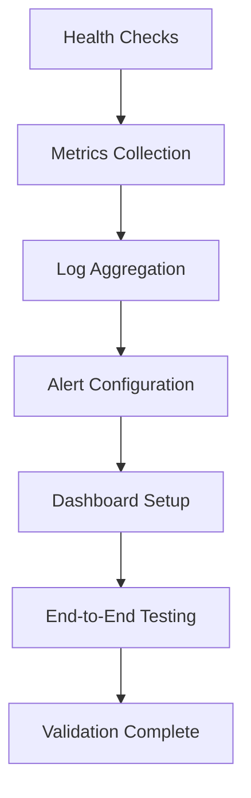

# Production Deployment Checklist Validation Guide

## Overview

The Production Deployment Checklist Validation system provides comprehensive pre-deployment verification to ensure all critical prerequisites, monitoring setup, backup procedures, security measures, and compliance requirements are met before production deployment.

## Table of Contents

1. [Quick Start](#quick-start)
2. [Validation Categories](#validation-categories)
3. [Running Validations](#running-validations)
4. [Understanding Results](#understanding-results)
5. [Action Items and Remediation](#action-items-and-remediation)
6. [CI/CD Integration](#cicd-integration)
7. [Troubleshooting](#troubleshooting)
8. [Best Practices](#best-practices)

## Quick Start

### Basic Validation

```bash
# Run basic deployment checklist validation
node production-readiness-tests/run-deployment-checklist-validation.js

# Run with verbose output
node production-readiness-tests/run-deployment-checklist-validation.js --verbose

# Generate detailed report
node production-readiness-tests/run-deployment-checklist-validation.js --report
```

### Environment-Specific Validation

```bash
# Production environment (default)
node production-readiness-tests/run-deployment-checklist-validation.js -e production

# Staging environment
node production-readiness-tests/run-deployment-checklist-validation.js -e staging

# Test environment
node production-readiness-tests/run-deployment-checklist-validation.js -e test
```

## Validation Categories

### 1. Infrastructure Prerequisites

**Critical Components:**
- **Server Provisioning**: EC2 instances, auto-scaling groups, availability zones
- **Database Setup**: RDS instances, connection pooling, read replicas
- **Load Balancing**: Application Load Balancer, health checks, SSL termination
- **CDN & Caching**: CloudFront distribution, cache policies, static assets
- **SSL Certificates**: Certificate installation, expiry monitoring, TLS configuration
- **DNS Configuration**: Route 53 records, health checks, failover setup

**Validation Checks:**
```javascript
// Example infrastructure validation
const infrastructureChecks = {
  serverProvisioning: [
    'server_instances_provisioned',
    'auto_scaling_configured',
    'availability_zones_distributed'
  ],
  databaseSetup: [
    'database_instance_provisioned',
    'connection_pooling_configured',
    'backup_configuration_verified'
  ]
};
```

### 2. Application Configuration

**Critical Components:**
- **Environment Variables**: Production configuration, secrets management
- **External Services**: Email, SMS, payment gateway integrations
- **Feature Flags**: Production feature configuration
- **Database Connections**: Connection strings, SSL configuration

**Validation Process:**
1. Verify all required environment variables are set
2. Test external service connectivity and authentication
3. Validate feature flag configurations
4. Confirm database connection parameters

### 3. Security & Compliance

**Critical Components:**
- **Security Headers**: CSP, HSTS, X-Frame-Options, X-Content-Type-Options
- **Authentication**: JWT configuration, session management, MFA setup
- **Data Encryption**: At-rest and in-transit encryption
- **Audit Logging**: Comprehensive logging, retention policies
- **Vulnerability Scanning**: Dependency scanning, container scanning

**Security Validation Matrix:**
```
┌─────────────────────┬──────────┬─────────────┬──────────────┐
│ Security Domain     │ Priority │ Validation  │ Blocking     │
├─────────────────────┼──────────┼─────────────┼──────────────┤
│ Security Headers    │ Critical │ Automated   │ Yes          │
│ Authentication      │ Critical │ Automated   │ Yes          │
│ Data Encryption     │ Critical │ Manual      │ Yes          │
│ Audit Logging       │ Critical │ Automated   │ Yes          │
│ Vulnerability Scan  │ High     │ Automated   │ Conditional  │
└─────────────────────┴──────────┴─────────────┴──────────────┘
```

### 4. Monitoring & Alerting

**Critical Components:**
- **Health Checks**: Application health endpoints, dependency checks
- **Metrics Collection**: Application metrics, business metrics, performance metrics
- **Log Aggregation**: Centralized logging, log parsing, search capabilities
- **Alerting**: Critical alerts, escalation procedures, notification routing
- **Dashboards**: Operational dashboards, business dashboards

**Monitoring Validation Workflow:**


### 5. Backup & Recovery

**Critical Components:**
- **Automated Backups**: Database backups, file storage backups
- **Backup Verification**: Integrity checks, restore testing
- **Disaster Recovery**: DR procedures, RTO/RPO validation
- **Point-in-Time Recovery**: Transaction log backups, recovery testing

**Recovery Validation Process:**
1. **Backup Configuration**: Verify automated backup schedules
2. **Backup Integrity**: Test backup file integrity and completeness
3. **Restore Procedures**: Execute restore procedures in test environment
4. **Recovery Time**: Validate RTO and RPO objectives
5. **Cross-Region**: Verify cross-region backup replication

### 6. Performance & Scaling

**Critical Components:**
- **Load Testing**: Performance baselines, bottleneck identification
- **Auto-Scaling**: Horizontal scaling, scaling policies
- **Caching**: Application caching, database caching, CDN optimization
- **Resource Monitoring**: CPU, memory, disk, network monitoring

### 7. Deployment Procedures

**Critical Components:**
- **CI/CD Pipeline**: Automated testing, deployment gates
- **Blue-Green Deployment**: Infrastructure setup, traffic switching
- **Database Migrations**: Migration scripts, rollback procedures
- **Static Assets**: Asset optimization, CDN deployment

### 8. Documentation & Training

**Critical Components:**
- **Operational Runbook**: Deployment procedures, troubleshooting guides
- **Incident Response**: Response plans, communication templates
- **User Documentation**: Updated guides, API documentation
- **Team Training**: Operations training, emergency procedures

## Running Validations

### Command Line Interface

```bash
# Basic validation
node run-deployment-checklist-validation.js

# With options
node run-deployment-checklist-validation.js \
  --environment production \
  --output-format json \
  --output-file deployment-results.json \
  --report deployment-report.json \
  --verbose
```

### Programmatic Usage

```javascript
import ProductionDeploymentChecklistValidator from './deployment-checklist-validator.js';

// Create validator
const validator = new ProductionDeploymentChecklistValidator({
  environment: 'production',
  strictMode: true,
  timeoutMs: 30000
});

// Run validation
const results = await validator.validateDeploymentReadiness();

// Generate report
const report = validator.generateDeploymentReport(results);

// Check deployment readiness
if (results.overall.status === 'ready') {
  console.log('✅ Deployment approved');
} else {
  console.log('❌ Deployment blocked');
  console.log('Action items:', results.actionItems);
}
```

### Integration with Testing Framework

```javascript
// Jest integration
describe('Deployment Readiness', () => {
  test('should pass all critical deployment checks', async () => {
    const validator = new ProductionDeploymentChecklistValidator();
    const results = await validator.validateDeploymentReadiness();
    
    expect(results.overall.status).not.toBe('not_ready');
    expect(results.summary.criticalIssues).toBe(0);
  });
});
```

## Understanding Results

### Overall Status Levels

**✅ READY**
- All critical checks passed
- Overall score ≥ 95%
- No critical issues
- Deployment approved

**⚠️ CONDITIONAL**
- Minor issues present
- Overall score 85-94%
- No critical issues
- Deployment can proceed with monitoring

**❌ NOT READY**
- Critical issues found
- Overall score < 85% OR critical issues > 0
- Deployment must be delayed

### Result Structure

```javascript
{
  overall: {
    status: 'ready|conditional|not_ready',
    score: 95,                    // 0-100
    recommendation: 'GO - System is ready',
    completionRate: 98,           // Percentage of items passed
    criticalIssuesCount: 0
  },
  summary: {
    totalItems: 50,
    passedItems: 49,
    failedItems: 1,
    warningItems: 0,
    criticalIssues: 0
  },
  categories: {
    infrastructure: {
      status: 'passed',
      score: 100,
      totalItems: 8,
      passedItems: 8,
      criticalIssues: 0
    }
    // ... other categories
  },
  actionItems: [
    {
      category: 'security',
      item: 'sslCertificates',
      priority: 'high',
      issue: 'Certificate expiry monitoring not configured',
      recommendation: 'Configure certificate monitoring alerts',
      estimatedEffort: '2-4 hours',
      blocking: false
    }
  ]
}
```

### Category Scoring

Each category is scored based on the percentage of passed checks:
- **100%**: All checks passed
- **80-99%**: Most checks passed, minor issues
- **60-79%**: Significant issues present
- **< 60%**: Major issues, category failed

### Weighted Overall Score

Categories have different weights in the overall score:
- **Security**: 25% (highest priority)
- **Infrastructure**: 20%
- **Monitoring**: 15%
- **Backup**: 15%
- **Application**: 10%
- **Performance**: 8%
- **Deployment**: 5%
- **Documentation**: 2%

## Action Items and Remediation

### Priority Levels

**🚨 CRITICAL**
- Must be fixed before deployment
- Blocks deployment approval
- Estimated effort: 4-8 hours
- Examples: Missing SSL certificates, failed security scans

**⚠️ HIGH**
- Should be fixed before deployment
- May impact system reliability
- Estimated effort: 2-4 hours
- Examples: Missing monitoring alerts, backup verification issues

**📝 MEDIUM**
- Should be addressed soon
- Minor impact on operations
- Estimated effort: 1-2 hours
- Examples: Documentation updates, non-critical configuration

**ℹ️ LOW**
- Nice to have improvements
- Minimal operational impact
- Estimated effort: < 1 hour
- Examples: Performance optimizations, cosmetic issues

### Remediation Workflow

1. **Triage Action Items**
   ```bash
   # Filter critical items
   cat deployment-report.json | jq '.actionItems[] | select(.priority == "critical")'
   ```

2. **Assign Ownership**
   - Infrastructure issues → DevOps team
   - Security issues → Security team
   - Application issues → Development team
   - Documentation → Technical writing team

3. **Track Progress**
   ```bash
   # Re-run validation after fixes
   node run-deployment-checklist-validation.js --report progress-report.json
   
   # Compare results
   diff deployment-report.json progress-report.json
   ```

4. **Verify Resolution**
   - Re-run specific category validation
   - Confirm action item resolution
   - Update deployment timeline

## CI/CD Integration

### GitHub Actions Integration

```yaml
name: Deployment Readiness Check
on:
  push:
    branches: [main]
  pull_request:
    branches: [main]

jobs:
  deployment-readiness:
    runs-on: ubuntu-latest
    steps:
      - uses: actions/checkout@v3
      
      - name: Setup Node.js
        uses: actions/setup-node@v3
        with:
          node-version: '18'
          
      - name: Install dependencies
        run: npm ci
        
      - name: Run deployment checklist validation
        run: |
          node production-readiness-tests/run-deployment-checklist-validation.js \
            --environment production \
            --output-format junit \
            --output-file deployment-results.xml \
            --report deployment-report.json
            
      - name: Upload results
        uses: actions/upload-artifact@v3
        if: always()
        with:
          name: deployment-readiness-results
          path: |
            deployment-results.xml
            deployment-report.json
            
      - name: Publish test results
        uses: dorny/test-reporter@v1
        if: always()
        with:
          name: Deployment Readiness Tests
          path: deployment-results.xml
          reporter: java-junit
```

### Jenkins Integration

```groovy
pipeline {
    agent any
    
    stages {
        stage('Deployment Readiness Check') {
            steps {
                script {
                    sh '''
                        node production-readiness-tests/run-deployment-checklist-validation.js \
                            --environment ${ENVIRONMENT} \
                            --output-format junit \
                            --output-file deployment-results.xml \
                            --report deployment-report.json
                    '''
                }
            }
            
            post {
                always {
                    junit 'deployment-results.xml'
                    archiveArtifacts artifacts: 'deployment-report.json', fingerprint: true
                }
                
                failure {
                    emailext (
                        subject: "Deployment Readiness Check Failed - ${env.JOB_NAME} #${env.BUILD_NUMBER}",
                        body: "Deployment readiness validation failed. Check the build logs and deployment report.",
                        to: "${DEPLOYMENT_TEAM_EMAIL}"
                    )
                }
            }
        }
    }
}
```

### Exit Codes for Automation

- **0**: Deployment ready (all critical checks passed)
- **1**: Deployment not ready (critical issues found)
- **2**: Validation error or configuration issue
- **3**: Conditional deployment (warnings but no critical issues)

## Troubleshooting

### Common Issues

**1. Validation Timeouts**
```bash
# Increase timeout
node run-deployment-checklist-validation.js --timeout 60000
```

**2. Network Connectivity Issues**
```bash
# Check external service connectivity
curl -I https://api.mailgun.net/v3
curl -I https://api.africastalking.com
```

**3. Database Connection Failures**
```bash
# Test database connectivity
psql -h $DB_HOST -U $DB_USER -d $DB_NAME -c "SELECT 1;"
```

**4. SSL Certificate Issues**
```bash
# Check certificate validity
openssl s_client -connect your-domain.com:443 -servername your-domain.com
```

### Debug Mode

```bash
# Enable verbose logging
DEBUG=deployment-checklist:* node run-deployment-checklist-validation.js --verbose

# Check specific category
node -e "
const validator = new ProductionDeploymentChecklistValidator();
validator.validateCategory('security', validator.checklistItems.security)
  .then(result => console.log(JSON.stringify(result, null, 2)));
"
```

### Validation Logs

Check validation logs for detailed information:
```bash
# View recent validation logs
tail -f logs/deployment-validation.log

# Search for specific errors
grep -i "error\|failed" logs/deployment-validation.log
```

## Best Practices

### Pre-Deployment Checklist

1. **Run Early and Often**
   - Run validation during development
   - Include in CI/CD pipeline
   - Run before each deployment

2. **Environment Parity**
   - Validate staging environment first
   - Ensure production mirrors staging
   - Test with production-like data

3. **Team Coordination**
   - Share validation results with team
   - Assign action item ownership
   - Set clear resolution timelines

4. **Documentation**
   - Keep runbooks updated
   - Document known issues and workarounds
   - Maintain deployment procedures

### Continuous Improvement

1. **Metrics Tracking**
   - Track validation success rates
   - Monitor deployment frequency
   - Measure time to resolution

2. **Checklist Evolution**
   - Add new checks based on incidents
   - Remove obsolete validations
   - Update priority levels

3. **Automation Enhancement**
   - Automate manual checks where possible
   - Improve validation accuracy
   - Reduce false positives

### Security Considerations

1. **Sensitive Data**
   - Never log sensitive information
   - Mask credentials in outputs
   - Secure validation reports

2. **Access Control**
   - Limit validation tool access
   - Use service accounts for automation
   - Audit validation activities

3. **Compliance**
   - Include compliance checks
   - Document validation procedures
   - Maintain audit trails

## Advanced Usage

### Custom Validation Rules

```javascript
// Extend validator with custom checks
class CustomDeploymentValidator extends ProductionDeploymentChecklistValidator {
  async performCustomCheck(category, item, check) {
    // Custom validation logic
    if (check === 'custom_security_scan') {
      const scanResult = await this.runSecurityScan();
      return {
        status: scanResult.passed ? 'passed' : 'failed',
        message: scanResult.message,
        severity: scanResult.severity
      };
    }
    
    return super.performCheck(category, item, check);
  }
}
```

### Integration with External Tools

```javascript
// Integrate with external monitoring tools
const validator = new ProductionDeploymentChecklistValidator({
  externalChecks: {
    monitoring: async () => {
      const response = await fetch('https://monitoring-api.com/health');
      return response.ok;
    },
    security: async () => {
      const scanResult = await securityScanner.scan();
      return scanResult.passed;
    }
  }
});
```

### Reporting Customization

```javascript
// Custom report generation
const report = validator.generateDeploymentReport(results);

// Add custom sections
report.customMetrics = {
  deploymentFrequency: await getDeploymentFrequency(),
  mttr: await getMeanTimeToRecovery(),
  changeFailureRate: await getChangeFailureRate()
};

// Export to different formats
await exportToPDF(report);
await exportToSlack(report);
await exportToJira(report);
```

This comprehensive guide provides everything needed to effectively use the Production Deployment Checklist Validation system for ensuring deployment readiness and maintaining high-quality production deployments.